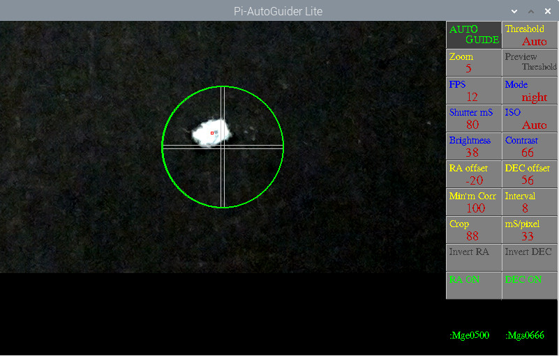

# Pi-AG_Lite

Beta version.

Uses Picamera and opencv (sudo apt install python3-opencv)

Output Pi GPIO and / or serial LX200 commands, eg to Arduino Autoguider https://github.com/Gordon999/Arduino-Uno-AutoGuider

## Screenshot

